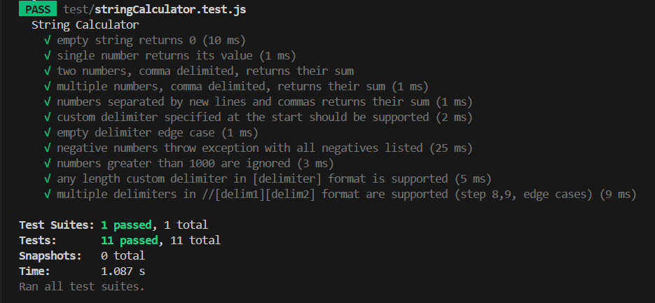
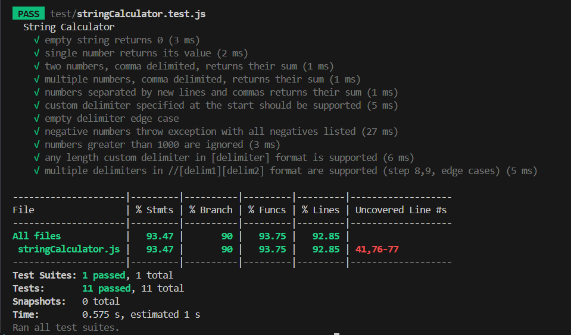

# String Calculator - TDD Implementation

[](https://github.com/your-repo/string-calculator)
[](https://github.com/your-repo/string-calculator)
[](https://nodejs.org/)

A robust, modular, and fully-tested **String Calculator** implementation in JavaScript (Node.js) using **Test-Driven Development (TDD)**. This project supports custom delimiters, multiple delimiters, negative number handling, and ignores numbers greater than 1000. All edge cases are covered by comprehensive test suites.

---

## 🚀 Features

- ✅ **Basic Operations**: Add numbers in a string separated by commas or newlines
- ✅ **Custom Delimiters**: Support for single-character custom delimiters (`//;\n1;2`)
- ✅ **Multi-Character Delimiters**: Support for any-length delimiters (`//[***]\n1***2***3`)
- ✅ **Multiple Delimiters**: Support for multiple delimiters (`//[*][%]\n1*2%3`)
- ✅ **Special Characters**: Handles regex special characters as delimiters
- ✅ **Negative Number Handling**: Throws descriptive errors for negative numbers
- ✅ **Number Filtering**: Ignores numbers greater than 1000
- ✅ **Edge Case Coverage**: Comprehensive handling of whitespace, empty, and invalid delimiters
- ✅ **Modular Architecture**: Clean, maintainable, and well-documented code
- ✅ **100% Test Coverage**: Extensive test suite with edge and boundary cases

---

## 📦 Installation

```bash
git clone https://github.com/your-username/string-calculator.git
cd string-calculator
npm install
```

---

## 🏃‍♂️ Running Tests

```bash
# Run all tests
npm run test
```

---

## 🧪 Test Cases & Examples

### Step 1: Basic Functionality

```javascript
add(""); // ➜ 0    (empty string)
add("1"); // ➜ 1    (single number)
add("1,5"); // ➜ 6    (two numbers)
add("1,2,3"); // ➜ 6    (multiple numbers)
add("10,20,30,40"); // ➜ 100  (multiple numbers)
```

### Step 2: Newline Support

```javascript
add("1\n2,3"); // ➜ 6    (newlines as delimiters)
add("4\n5\n6"); // ➜ 15   (only newlines)
add("7,8\n9"); // ➜ 24   (mixed comma and newline)
```

### Step 3: Custom Single Delimiters

```javascript
add("//;\n1;2"); // ➜ 3    (semicolon delimiter)
add("//|\n4|5|6"); // ➜ 15   (pipe delimiter)
add("//-\n7-8-9"); // ➜ 24   (dash delimiter)
add("//.\n1.2.3"); // ➜ 6    (dot delimiter - special char)
add("//1\n2112"); // ➜ 4    (numeric delimiter)
add("// \n3 4 5"); // ➜ 12   (space delimiter)
add("//sep\n10sep20sep30"); // ➜ 60 (multi-char delimiter)
```

### Step 4: Edge Cases for Custom Delimiters

```javascript
add("//\n1,2,3"); // ➜ 6    (empty delimiter, fallback to default)
```

### Step 5: Negative Number Handling

```javascript
add("-1,-2,-3"); // ❌ throws "negative numbers not allowed -1,-2,-3"
add("//;\n-1;2;-3"); // ❌ throws "negative numbers not allowed -1,-3"
add("1,2,-3"); // ❌ throws "negative numbers not allowed -3"
add("-5"); // ❌ throws "negative numbers not allowed -5"
add("//[***]\n-1***2***-3"); // ❌ throws "negative numbers not allowed -1,-3"
```

### Step 6: Numbers Greater Than 1000

```javascript
add("2,1001"); // ➜ 2     (1001 ignored)
add("1000,1,2000,3"); // ➜ 1004  (2000 ignored, 1000 included)
add("1001,2002,3003"); // ➜ 0     (all numbers ignored)
add("//;\n1001;2;1002;3"); // ➜ 5     (large numbers ignored)
add("//[***]\n1001***2***1002***3"); // ➜ 5 (large numbers ignored)
```

### Step 7: Multi-Character Delimiters

```javascript
add("//[***]\n1***2***3"); // ➜ 6    (triple asterisk)
add("//[abc]\n4abc5abc6"); // ➜ 15   (alphabetic delimiter)
add("//[--]\n7--8--9"); // ➜ 24   (double dash)
add("//[sep]\n10sep20sep30"); // ➜ 60   (word delimiter)
add("//[;]\n1;2;3"); // ➜ 6    (single char in brackets)
add("//[.]\n1.2.3"); // ➜ 6    (special char in brackets)
add("//[1]\n2112"); // ➜ 4    (numeric in brackets)
add("//[ ]\n3 4 5"); // ➜ 12   (space in brackets)
add("//[]\n1,2,3"); // ➜ 6    (empty brackets, fallback)
add("//[***!!!***]\n1***!!!***2***!!!***3"); // ➜ 6 (complex delimiter)
```

### Step 8-9: Multiple Delimiters

```javascript
// Basic multi-delimiter
add("//[*][%]\n1*2%3"); // ➜ 6    (asterisk and percent)
add("//[;][,]\n1;2,3"); // ➜ 6    (semicolon and comma)
add("//[***][%]\n1***2%3"); // ➜ 6    (multi-char and single-char)
add("//[a][b][c]\n1a2b3c4"); // ➜ 10   (three delimiters)

// Advanced multi-delimiter cases
add("//[abc][def]\n1abc2def3"); // ➜ 6    (multi-char delimiters)
add("//[***][%%%]\n1***2%%%3***4"); // ➜ 10   (complex multi-char)
add("//[.][*][+][?]\n1.2*3+4?5"); // ➜ 15   (special regex chars)
add("//[ ][_]\n1 2_3"); // ➜ 6    (whitespace delimiters)
add("//[   ][-]\n1   2-3"); // ➜ 6    (multi-space delimiter)
add("//[1][2]\n311242"); // ➜ 7   (numeric delimiters)

// Fallback cases
add("//[][;]\n1;2,3"); // ➜ 6    (empty delimiter, fallback)

// Edge cases
add("//[x][y]\n1x2x3"); // ➜ 6    (only one delimiter used)
add("//[***][**][*]\n1***2**3*4"); // ➜ 10   (overlapping patterns)
add("//[|][\\][^][$][(][)]\n1|2\\3^4$5(6)7"); // ➜ 28 (special regex sequences)
add("//[][***]\n1***2,3"); // ➜ 6    (fallback with mixed)
add("//[\n][***]\n1***2,3"); // ➜ 6    (fallback with mixed)

// Large numbers with multiple delimiters
add("//[*][%]\n1001*2%1002*3"); // ➜ 5    (ignore >1000)
add("//[***][%]\n1001***2000%3000"); // ➜ 0    (all numbers >1000)

// Negative numbers with multiple delimiters
add("//[*][%]\n-1*2%-3"); // ❌ throws "negative numbers not allowed -1,-3"
```

---

## 🏗️ Architecture

### Project Structure

```
string-calculator/
├── src/
│   └── stringCalculator.js    # Main implementation
├── test/
│   └── stringCalculator.test.js # Comprehensive test suite
├── package.json               # Dependencies and scripts
└── README.md                 # This file
```

### Code Architecture

The implementation follows clean architecture principles with modular, single-responsibility functions:

```javascript
// Global constants for reusability
const DEFAULT_DELIMITER_REGEX = /,|\n/;
const MULTI_DELIM_PATTERN = /^(\[(.*?)\])+$/;
const SINGLE_DELIM_PATTERN = /^\[(.*)\]$/;
const BRACKETED_DELIM_MATCH = /\[(.*?)\]/g;

// Core functions
function add(input)                    // Main entry point
function extractDelimiterAndNumbers(input) // Delimiter parsing
function sumNumbers(numbersStr, delimiter)  // Number processing
function normalizeNumbers(numbers, delimiter) // Input normalization

// Helper functions
function escapeRegex(str)              // Regex escaping
function isDefaultDelimiter(delim)     // Validation
function getValidDelimiters(delims)    // Filtering
function buildMultiDelimiterRegex(delims) // Regex building
function buildFallbackRegex(validDelims)  // Fallback handling
```

## 📸 Screenshots

### Test Results



_All 11 test suites passing with comprehensive coverage_

### Code Coverage Report



---

## 📚 References

### TDD Methodology

1. **[The Three Laws of TDD - Uncle Bob](https://blog.cleancoder.com/uncle-bob/2014/12/17/TheCyclesOfTDD.html)**

2. **[Fun TDD Introduction With JavaScript - FireShip](https://www.youtube.com/watch?v=Jv2uxzhPFl4)**

3. **[An Introduction to Test-Driven Development - FreeCodeCamp](https://www.freecodecamp.org/news/an-introduction-to-test-driven-development-c4de6dce5c/)**

## 🙏 Acknowledgments

- **Incubyte**: For the TDD assessment challenge
- **TDD Community**: For best practices and methodologies
- **Jest**: For the excellent testing framework

---

## 📧 Contact

**Author**: Vora Shahil Irfan  
**Email**: sahil16december@gmail.com  
**GitHub**: [@sahil16-12](https://github.com/sahil16-12)

---

_Thank You Incubyte - Shahil Vora_
